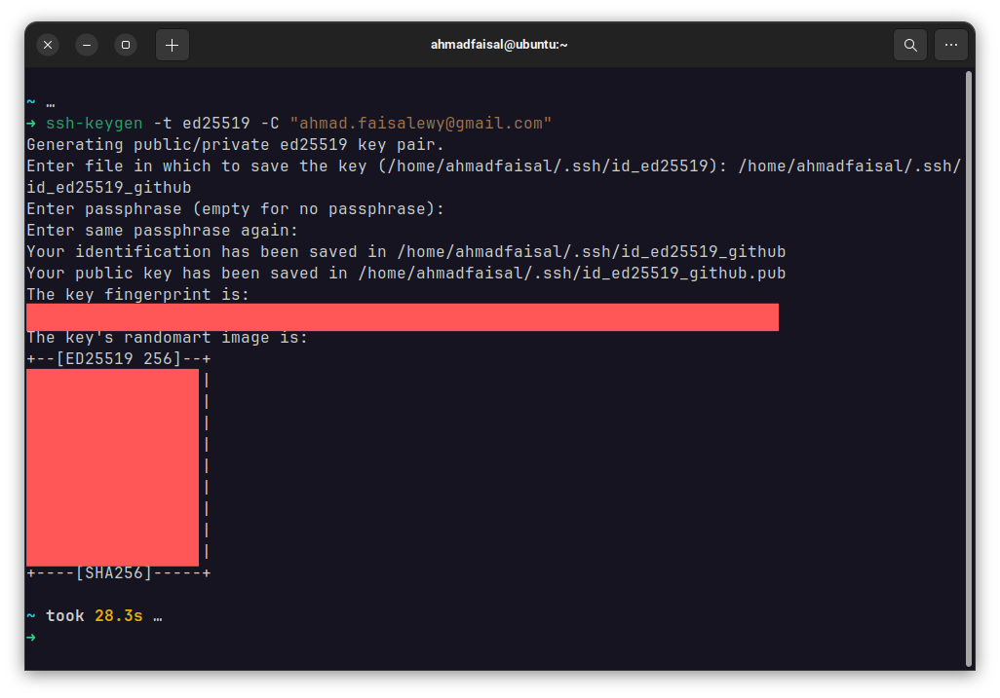

# Leveraging Git as Your Version Control System

Repositori ini dibuat untuk mendemonstrasikan penggunaan Git dan GitHub untuk acara pengenalan Google Developer Student Clubs Institut Teknologi Telkom Surabaya.

Pada Study Jam ini, pastikan anda telah memiliki:

1. Git yang sudah terinstall di Sistem Operasi. Tutorial ada di bab 1.
2. Akun GitHub, yang dapat dibuat di [**github.com**](https://github.com/).

## 1. Cara Menginstall Git


### 1.1 Install Git di Windows

1. Kunjungi [git-scm.org](https://git-scm.org). Pilih "**Download for Windows**".

    

2. Pilih "**Standalone Installer**" yang 64 bit. Tunggu hingga download selesai.

    

3. Klik 2x pada installer, maka akan muncul halaman lisensi. Klik "**Next**".

    

4. Pilih lokasi instalasi Git, biarkan default di `C:\Program Files\Git`. Klik "**Next**".

    

5. Pilih komponen yang ingin di-install. Centang "**Add a Git Bash Profile to Windows Terminal**" agar bisa menjalankan Git di terminal Windows (CMD dan Powershell). Jika ingin ada shortcut di Desktop, centang "**Additional icons**". Klik "**Next**".

    

6. Pilih nama folder Start Menu, biarkan default. Klik "**Next**".

    

7. Pilih code editor default untuk Git. Secara default, opsinya adalah menggunakan Vim. Karena Vim sulit digunakan, pilih code editor lain seperti Visual Studio Code melalui dropdown. Pastikan VSCode telah terinstall dahulu. Klik "**Next**".

    

8. Pilih nama branch default. Pilih "**Let Git decide**" agar default branch tetap bernama `master`. Klik "**Next**".

    

9. Pilih konfigurasi PATH. Pilih "**Git from the command line and also from 3rd-party software**" agar Git bisa dijalankan juga di luar Git Bash. Klik "**Next**".

    

10. Pilih program SSH yang digunakan Git, biarkan default. Klik "**Next**".

    

11. Pilih SSL library yang digunakan Git, biarkan default. Klik "**Next**".

    

12. Pilih konfigurasi konversi *line ending*, biarkan default. Klik "**Next**".

    

13. Pilih terminal emulator untuk Git Bash, biarkan default. Klik "**Next**".

    

14. Pilih perilaku default untuk `git pull`, biarkan default. Klik "**Next**".

    

15. Pilih credential helper, biarkan default. Klik "**Next**".

    

16. Atur konfigurasi tambahan, centang "**Enable file system caching**". Klik "**Next**".

    

17. Atur konfigurasi experimental, jangan pilih apapun. Setelah itu, klik "**Install**" untuk memulai instalasi. Tunggu hingga selesai.

    

18. Instalasi selesai, klik "**Finish**".

    

19. Klik aplikasi "**Git Bash**", maka akan muncul terminal emulator MSYS2 yang dapat digunakan untuk menjalankan Git. Git juga dapat dijalankan di luar "**Git Bash**", misalnya Command Prompt dan Powershell. Periksa instalasi dengan menjalankan perintah berikut: `git --version`. 

    

### 1.2 Install Git di Linux

Biasanya, Git sudah terinstall secara bawaan di sistem operasi berbasis Linux. Jika tidak, maka Git dapat diinstall menggunakan package manager setiap distro Linux.

#### 1.2.1 Debian-based

```bash
sudo apt install git
```

#### 1.2.2 RPM-based

```bash
sudo dnf install git
```

#### 1.2.3 Arch-based

```bash
sudo pacman -S git
```

## 2. Konfigurasi Tambahan Git

Setelah berhasil melakukan instalasi, lakukan beberapa konfigurasi tambahan berikut:

### 2.1 Konfigurasi Profil

Buka terminal. Jalankan perintah berikut, ganti credential dan hapus tanda kurung kurawal.

1. Konfigurasi nama:

    ```bash
    git config --global user.name "{Nama Lengkap}"
    ```

2. Konfigurasi email:

    ```bash
    git config --global user.email "{example@gmail.com}"
    ```

### 2.2 Konfigurasi Protokol Transfer SSH

Konfigurasi protokol transfer SSH yang digunakan Git ke Github dengan langkah-langkah berikut:

Pertama-tama, cek apakah sudah ada pasangan kunci SSH atau belum dengan perintah berikut:

```
ls -al ~/.ssh
```

Jika tidak ada file dengan ekstensi `.pub`, artinya anda belum memiliki pasangan kunci tersebut. Jika sudah, anda dapat lompat langsung ke langkah nomor 4.

1. Buka terminal, CMD, Powershell, atau sejenisnya.
2. Buat pasangan kunci SSH (public dan private) di local machine dengan menjalankan perintah berikut:
    ```bash
    ssh-keygen -t ed25519 -C "{example@gmail.com}"
    ```
    Ganti email dengan email yang terdaftar di Github.
3. Kemudian, anda akan diminta lokasi disimpannya file tersebut (lokasi default di Windows ada di `C:\Users\{USER}\.ssh\id_ed25519`). Biarkan default atau ubah sesuai keinginan. Tekan **Enter**, lalu anda akan dimintai password. Isikan password atau biarkan kosong (opsional). Tekan **Enter**, maka pasangan kunci public (dengan ekstensi `.pub`) dan private akan dibuat di lokasi tersebut.

    

4. Jalankan perintah berikut untuk mencetak public key yang barusan dibuat.

    ```
    cat ~/.ssh/id_ed25519.pub
    ```
    Perintah ini akan menampilkan public key dari pasangan kunci SSH, copy baris key tersebut mulai dari `id_ed25519.pub` hingga email anda.

5. Buka [github.com](https://github.com), klik gambar profile di pojok kanan atas. Kemudian pilih **Settings** > **SSH and GPG keys** > **New SSH key**. Isikan judul unik, dan paste public key tadi ke field **Key**. Setelah itu klik **Add SSH key**.

6. Buka terminal lagi, kemudian jalankan perintah berikut:
    ```
    ssh -T git@github.com
    ```
    Jika konfigurasi berhasil, anda akan mendapatkan output berikut:
    ```
    Hi {username_github}! You've successfully authenticated, but GitHub does not provide shell access.
    ```
    Konfigurasi protokol SSH untuk Github telah selesai. Jika gagal, silakan kunjungi [link berikut](https://docs.github.com/en/authentication/troubleshooting-ssh/error-permission-denied-publickey).

Dengan ini, Git sudah mantap untuk digunakan :)
